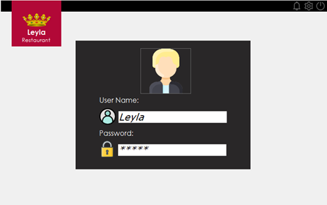
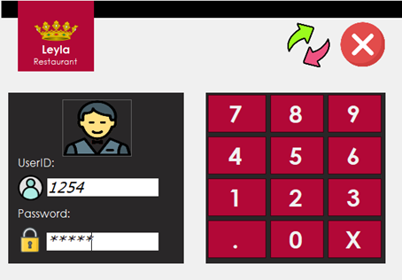
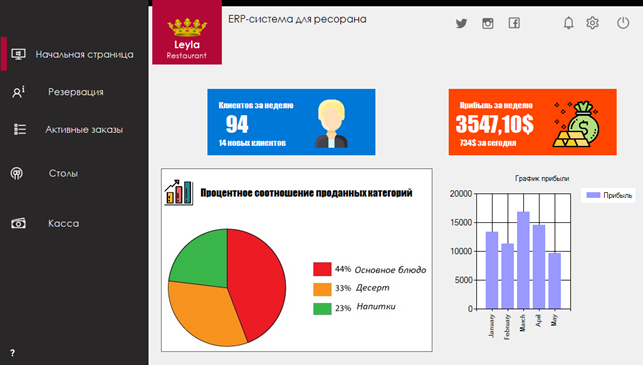
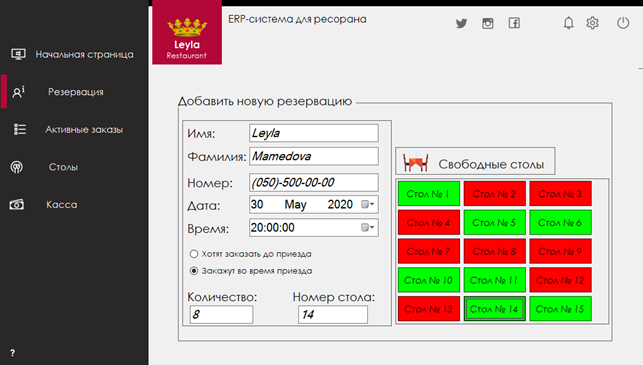
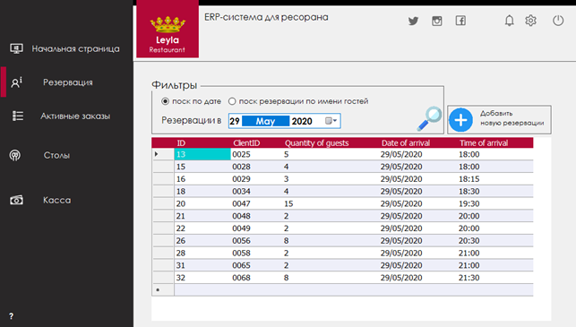
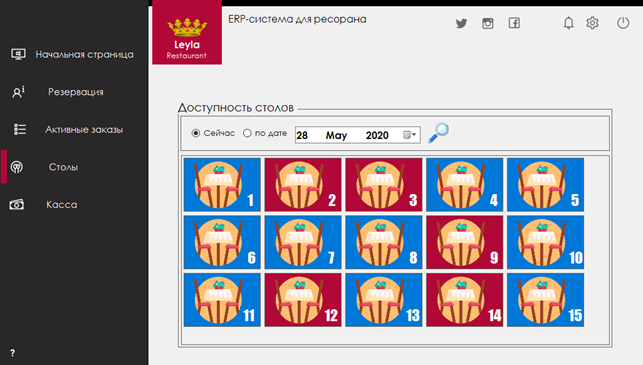
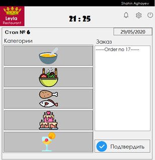
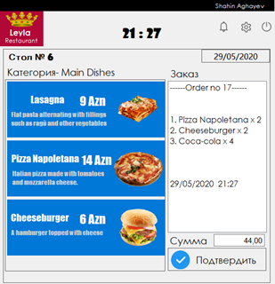
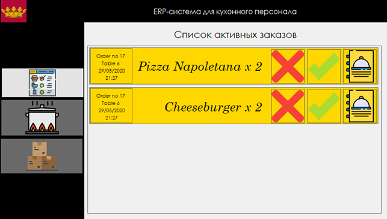

# ERP_System_For_Restaurant_mini

Basic desktop application developed with C# windowsform, which represents the ERP system for the fast food restaurant.
This application contains three types of users, where each of these users has its own interface. In the following images you can see the design of some screens.

## Login pages of the application

### Login as a managing staff

### Login as a service personell

## Main page for the managing staff

### Making a new reservation

### Page for checking active reservations

### Status of the tables

## Waitor screen for receiving a new order

## Screen for the kitchen personell

